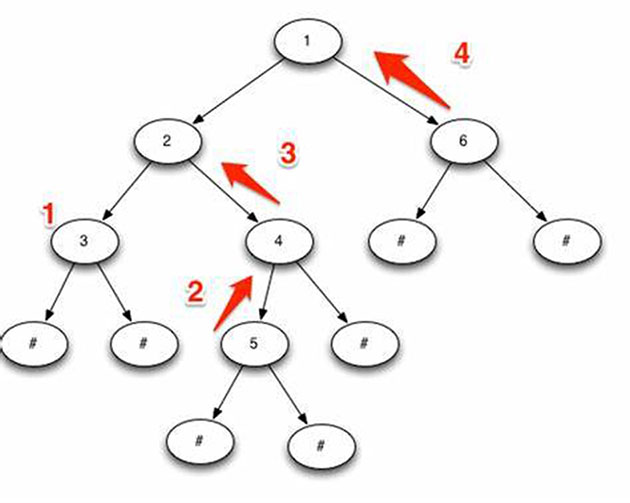

# <center>SteemJS中文手册</center>

## 目录

- [下载与资源：](#下载与资源)
- [steemjs安装](#steemjs安装)
- [Steem API节点](#steem-api节点)
- [Auth权限](#auth权限)
- [用dsteem创建免费帐户](#用dsteem创建免费帐户)
- [付费创建新用户](#付费创建新用户)
- [steem登录](#steem登录)
- [更新帐户](#更新帐户)
- [获取某作者的最近的文章列表](#获取某作者的最近的文章列表)
- [用递归查询某作者一个时间点之前的所有文章](#用递归查询某作者一个时间点之前的所有文章)
- [用异步方法取出某作者所有的文章](#用异步方法取出某作者所有的文章)
- [用while循环取出所有的文章](#用while循环取出所有的文章)
- [获取文章的函数们](#获取文章的函数们)
- [一篇文章的格式](#一篇文章的格式)
- [依据tags对文章分类](#依据tags对文章分类)
- [获取流行标签](#获取流行标签)
- [json_metadata](#json_metadata)
- [获取某位作者某篇文章的内容](#获取某位作者某篇文章的内容)
- [获取某篇文章的回复](#获取某篇文章的回复)
- [获取某作者发表的所有评论](#获取某作者发表的所有评论)
- [获取用户的关注列表](#获取用户的关注列表)
- [获取帐户数据](#获取帐户数据)
- [获取用户历史](#获取用户历史)
- [遍历出用户所有历史](#遍历出用户所有历史)
- [几个broadcast函数](#几个broadcast函数)
- [发贴或评论](#发贴或评论)
- [点赞某篇文章](#点赞某篇文章)
- [customJson](#customjson)
- [关注功能follow](#关注功能follow)
- [实时获取链上数据](#实时获取链上数据)
- [获取作者并自动点赞](#获取作者并自动点赞)
- [SteemConnect](#steemconnect)
- [vue-SteemConnect](#vue-steemconnect)
- [steem keychain](#steem-keychain)
- [获取粉丝列表](#获取粉丝列表)
- [获取关注列表](#获取关注列表)
- [递归获取某篇文章的所有回复](#递归获取某篇文章的所有回复)
- [递归组件展示父子回复](#递归组件展示父子回复)
- [几个Async函数](#几个async函数)
- [查看对作者的最新回复](#查看对作者的最新回复)


## 下载与资源：
[SteemJS手册 |](https://github.com/steemit/steem-js/tree/master/doc#install)
[参考1 |](https://steemit.com/steemjs/@fabien/steemjs)
[参考2 |](https://github.com/Stormrose/steem-js/tree/master/doc)
[steemsnippets |](https://github.com/drov0/steemsnippets/tree/master/dsteem)
[参考3 |](https://steemit.com/utopian-io/@lonelywolf/steemjs-full-tutorial-all-the-functions-all-the-abilities)
[steem-python](https://steem.readthedocs.io/en/latest/core.html)

## steemjs安装
"steem": "^0.7.7",
```js
cnpm install steem --save

import steem from 'steem'

//设置steem节点,挂载到全局
steem.api.setOptions({ url: 'https://anyx.io' })
// steem.api.setOptions({ url: 'https://api.steemit.com' })
Vue.prototype.steem= steem
```

## Steem API节点
[查询](https://developers.steem.io/quickstart/#quickstart-choose-library)

//公共节点，前面加上 https://
地址|作者        
------------|------------ 
anyx.io|@anyx
api.steemit.com|@steemit
api.steem.house|@gtg
appbasetest.timcliff.com|@timcliff
gtg.steem.house:8090|@gtg
hive.anyx.io|@anyx
rpc.steemviz.com|@ausbitbank
rpc.usesteem.com|@themarkymark
steemd.minnowsupportproject.org|@followbtcnews
steemd.privex.io|@privex


## Auth权限
```js
Verify //认证
steem.auth.verify(name, password, auths)
eg:
let username = 'epexa'
let password = 'P5...' // 用户密码
let auths = {
    posting: [['STM6...']],
}
steem.auth.verify(username, password, auths)  //return true or false

Generate Keys  //生成公钥对
steem.auth.generateKeys(name, password, roles)
let publicKeys = this.steem.auth.generateKeys(newAccountName, newAccountPassword, ['owner', 'active', 'posting', 'memo'])
  //返回数据
  {owner: "STM5vFQtKD5UWRL2A5HkzVTaT39y5ooqoUbBwoXbxgdXuEdkDnXR5", active: "STM66Gn72YKir393f2VXnuiHMPHKqfmnE341XCh1Wycnn6ZRenx4k", posting: "STM7L3QUgSLAZYHWHX7xzAsMA63CwbTMvAw1MFgAexePegSwK5QtD", memo: "STM58gNrK6Pex5mkeVgHM6nkpGN83sXzkm7bnhWsQ1BLn7AVfYzkc"}


Get Private Keys //从用户名和密码得到对应的公私钥
steem.auth.getPrivateKeys(name, password, roles)
let roles = ['owner', 'active', 'posting', 'memo']
let res = this.steem.auth.getPrivateKeys(name, password, roles)
  //返回数据
  active: "5J81RXJwxLNz2exiQqYVaFDKDSvqn8qHwWjsLDGWjApACBWEZCw"
  activePubkey: "STM5xzjJtutZywhC5pjPXt7Kkkk9B7VEuwWrHVrYK2YJameDtDhho"
  memo: "5HpgaGtT1oQQUFuqH5d94FAqyEX9SVTJQHX19hXpGKQXe8w2tXi"
  memoPubkey: "STM7BFYtrEgY5sB4BTmyvdZf9cgmECKujcRqTHCXk2tdf2kQ95ULF"
  owner: "5JfxkpNEBFD7v6tRiew55F2fDkGKVSvvzPrR5q6KmJ65dv9PG9n"
  ownerPubkey: "STM8WN3VznWshG4Q32jBM7iuDwA4mkXZDtHwXx5zBrHSCwQV2nssx"
  posting: "5Jv9NHkL8TrdvJNue2EKZHQDbXJqXGoaBBt8xy6q6ep1AkMA3VS"
  postingPubkey: "STM5f2H2rbSmVoEzrVSpfYGrP1qTp5Lyq1nPDen9hwA3AxFwLYAGs"

Is Wif //判断是否是私钥，返回 true 或 false
steem.auth.isWif(privWif)
let privWif = "5JfxkpNEBFD7v6tRiew55F2fDkGKVSvvzPrR5q6KmJ65dv9PG9n"
let res = this.steem.auth.isWif(privWif)  //true

To Wif //从用户名和密码得到对应的私钥
steem.auth.toWif(name, password, role)
let role = ["active"]
let res = this.steem.auth.toWif(name, password, role)
  //返回数据
  "5Jv9NHkL8TrdvJNue2EKZHQDbXJqXGoaBBt8xy6q6ep1AkMA3VS"

Wif Is Valid //验证公私钥对是否匹配，返回true 或 false
steem.auth.wifIsValid(privWif, pubWif)
let privWif = "5Jv9NHkL8TrdvJNue2EKZHQDbXJqXGoaBBt8xy6q6ep1AkMA3VS"
let pubWif = "STM5f2H2rbSmVoEzrVSpfYGrP1qTp5Lyq1nPDen9hwA3AxFwLYAGs"
let res = this.steem.auth.wifIsValid(privWif, pubWif)   //true


Wif To Public //从私钥得到对应的公钥
steem.auth.wifToPublic(privWif)
let privWif = "5Jv9NHkL8TrdvJNue2EKZHQDbXJqXGoaBBt8xy6q6ep1AkMA3VS"
let res = this.steem.auth.wifToPublic(privWif)

Sign Transaction
steem.auth.signTransaction(trx, keys)
```


## 用dsteem创建免费帐户
[参考steemsnippets |](https://github.com/drov0/steemsnippets/tree/master/dsteem)
[SteemJs注册的两种方法](https://steemjiang.com/article/jezmg)

每个新帐户大约需：10,133,795,853,389 RC. 

<b-button variant="outline-primary" @click="claim_account">申明帐户</b-button>
<b-button variant="outline-primary" @click="create_discounted_account">注册新帐户</b-button>

```js
cnpm install dsteem --save
//main.js
const dsteem = require('dsteem')
const client = new dsteem.Client('https://anyx.io')
Vue.prototype.dsteem = dsteem
Vue.prototype.client = client

claim_account() {
  const creator = "lemooljiang"
  const active_key = "5Jffffffffff"
  return new Promise(resolve => {
      const wif = this.dsteem.PrivateKey.fromString(active_key)
      const fee = this.dsteem.Asset.from(0, 'STEEM')
      const op = [
          'claim_account',
          {
              creator: creator,
              extensions: [],
              fee: fee
          }]

      this.client.broadcast.sendOperations([op], wif).then(function (result) {
          console.log('11,Included in block: ' + result.block_num)
          console.log('222，申明新帐户创建成功！' )
          resolve("ok")
      }, function (error) {
        console.error(error)
        console.log('333，申明新帐户创建失败！' )
        resolve("err")
      })
  })
},
create_discounted_account() {
  const creator = "lemooljiang"
  const active_key = "5Jofffffffffffff"
  const username = this.username
  const password = this.password
  return new Promise(resolve => {
      const wif = this.dsteem.PrivateKey.fromString(active_key)
      const prefix = this.client.addressPrefix
      const ownerKey = this.dsteem.PrivateKey.fromLogin(username, password, 'owner').createPublic(prefix)
      let owner = this.dsteem.Authority.from(ownerKey)
      const activeKey = this.dsteem.PrivateKey.fromLogin(username, password, 'active').createPublic(prefix)
      let active = this.dsteem.Authority.from(activeKey)
      const postingKey = this.dsteem.PrivateKey.fromLogin(username, password, 'posting').createPublic(prefix)
      let posting = this.dsteem.Authority.from(postingKey)
      let memo_key = this.dsteem.PrivateKey.fromLogin(username, password, 'memo').createPublic(prefix)

      const metadata =  {date: new Date()}
      const create_op = [
          'create_claimed_account',
          {
              active,
              creator,
              extensions: [],
              json_metadata: metadata ? JSON.stringify(metadata) : '',
              memo_key,
              new_account_name: username,
              owner,
              posting,
          }
      ]

      this.client.broadcast.sendOperations([create_op], wif).then(function (result) {
          console.log('22, Included in block: ' + result.block_num)
          console.log('666，新帐户创建成功！' )
          resolve("ok")
      }, function (error) {
          console.log('444，新帐户创建失败！' )
          console.error(error)
          resolve("err")
      })
  })
},
```


## 付费创建新用户
[参考steemsnippets](https://github.com/drov0/steemsnippets/blob/master/steemjs/create_account/create_account.js)

这里, 我们要借助 Steem 官方提供的 steem-js SDK, 来创建账号, 主要用到的 API 有两个：
steem.auth.generateKeys 用于生成4组密钥(owner, active, posting, memo)，
steem.broadcast.accountCreate 用于创建账号
```js
register() {
  let newAccountName = "bettyliu"  //新帐户
  let newAccountPassword = "FDDjjjRTLOu456"  //新帐户密码
  let publicKeys = this.steem.auth.generateKeys(newAccountName, newAccountPassword, ['owner', 'active', 'posting', 'memo'])
  let owner = { weight_threshold: 1, account_auths: [], key_auths: [[publicKeys.owner, 1]] }
  let active = { weight_threshold: 1, account_auths: [], key_auths: [[publicKeys.active, 1]] }
  let posting = { weight_threshold: 1, account_auths: [], key_auths: [[publicKeys.posting, 1]] }
  let memoKey = publicKeys.memo
  console.log(1234, publicKeys)
  console.log(23456, active)

  let creator = "lemooljiang"  //创建者
  let creatorWif = "5Jbfffffffffffffff"  //创建者的资金密钥
  let fee = "3.000 STEEM"    //费用
  let jsonMetadata = ""
  this.steem.broadcast.accountCreate(
      creatorWif,
      fee,
      creator,
      newAccountName,
      owner,
      active,
      posting,
      memoKey,
      jsonMetadata,
      (err, result) => {
        if(err){
          console.log(444, '创建失败！', err)
        }else{
          console.log(666, '创建成功！', result)
        }
      })
}
```


## steem登录
[参考steemsnippets](https://github.com/drov0/steemsnippets/blob/master/steemjs/test_login/test_login.js)
```js
//用发贴私钥或密码登录
login(){
  //用私钥或密码登录
  this.isLoading = true
  let account = this.username
  this.steem.api.getAccounts([account], (err, result) => {
    if(result.length === 0){
      this.isLoading = false
      alert("用户不存在！")
    }else{
      //用户存在
      let pubWif = result[0].posting.key_auths[0][0]
      let privWif = this.password
      let isvalid
      //判断是私钥还是密码
      let res = this.steem.auth.isWif(privWif)
      if(res === true){
        //是私钥
        console.log(456, res, '是私钥！')
        try{
          isvalid = this.steem.auth.wifIsValid(privWif, pubWif)
        }
        catch(e){
          isvalid = 'false'
        }
        if(isvalid === true){
          this.isLoading = false
          console.log(' Welcome.', account)
          this.$store.commit('saveUser', {username: account, password: privWif})
          this.$router.push({path:'/'})
        }else{
          this.isLoading = false
          alert(`错误！请检查用户名和发贴密钥！`)
        }
      }else{
        //是密码
        console.log(458, res, '是密码')
        //获取发贴私钥
        let role = ["posting"]
        let Wif = this.steem.auth.toWif(account, privWif, role)
        try{
          isvalid = this.steem.auth.wifIsValid(Wif, pubWif)
        }
        catch(e){
          isvalid = 'false'
        }
        if(isvalid === true){
          this.isLoading = false
          console.log(' Welcome.', account)
          this.$store.commit('saveUser', {username: account, password: Wif})
          this.$router.push({path:'/'})
        }else{
          this.isLoading = false
          alert(`错误！请检查用户名和密码！`)
        }
      }
    }

  })
}
```

## 更新帐户
```
steem.broadcast.accountUpdate(wif, account, owner, active, posting, memoKey, jsonMetadata, function(err, result) {
  console.log(err, result)
})
```


## 获取某作者的最近的文章列表
```js
steem.api.getDiscussionsByAuthorBeforeDate(author, startPermlink, beforeDate, limit, function(err, result) {
  console.log(err, result)
})

//使用，一次最多能取100篇
getPosts(){
  let beforeDate=new Date().toISOString().split('.')[0]
  let author = "lemooljiang"
  this.steem.api.getDiscussionsByAuthorBeforeDate(author, null, beforeDate, 100, function(err, result) {
    console.log(567, err, result)
  })
}
```

## 用递归查询某作者一个时间点之前的所有文章
先设一个时间点，再从这个时间点后查询出其所有文章。这用在同步文章方面很实用。
```js
function getPostsFromSteem(author, startPermlink, limit, posts, startTime){
  //传入要查询的作者名，初始标签，一次查询的条数，初始化数组, 起始时间
  return new Promise((resolve, reject) => {
    let beforeDate = new Date().toISOString().split('.')[0]
    this.steem.api.getDiscussionsByAuthorBeforeDate(author, startPermlink, beforeDate, limit, (err, result) => {
      let newResult = []
      result.forEach(post => {
        if (post.permlink !== startPermlink) {
          newResult.push(post)
        }
      })
      posts = [...posts, ...newResult]
      if (result.length > 1 && result[result.length - 1].created > startTime) {
        this.getPostsFromSteem(author, result[result.length - 1].permlink, limit, posts, startTime)
            .then(resolve)
            .catch(reject)
      } else {
        resolve(posts)
      }
    })
  })
}
//调用
let _this = this
let author = "lemooljiang"
let startTime = "2020-01-06T01:59:45"
async function main(){
    let steemposts = await _this.getPostsFromSteem(author, null, 10, [], startTime)
    console.log(12345, steemposts)
}
main()
```

## 用异步方法取出某作者所有的文章
```js
async function main(author, startPermlink, beforeDate, limit){
  let posts = []
  while(true){
    let result = await that.steem.api.getDiscussionsByAuthorBeforeDateAsync(author, startPermlink, beforeDate, limit)
    console.log(655,result)
    //做一次遍历去掉重复的文章
    result.forEach(post => {
      if (post.permlink != startPermlink) {
        posts.push(post)
      }
    })
    //取到最后一篇文章的Permlink，做为下一次查询的起始点
    startPermlink = result[result.length - 1].permlink
    //如果只能查询到一篇文章，则这是最后一篇了，可以终止查询了
    if(result.length == 1){
      console.log(888, that.posts)
      break
    }
  }
  return posts
}
let author = 'lemooljiang'
let beforeDate = new Date().toISOString().split('.')[0]
let that = this
main(author, null, beforeDate, 100)  //传入要查询的作者名，初始标签，初始时间，一次查询的条数
```

## 用while循环取出所有的文章
```js
getPosts(author, startPermlink, limit, posts) {
  let that = this
  return new Promise((resolve, reject) => {
    let beforeDate = new Date().toISOString().split('.')[0]
    that.steem.api.getDiscussionsByAuthorBeforeDate(author, startPermlink, beforeDate, limit, function (err, result) {
      //做一次遍历去掉重复的文章
      result.forEach(post => {
        if (post.permlink != startPermlink) {
          that.newposts.push(post)
        }
      })
      resolve(result)
    })
  })
}

//mounted函数中
let _this = this
async function main(author, startPermlink, limit, posts){
  while(true){
    let result = await _this.getPosts(author, startPermlink, limit, posts)
    //取到最后一篇文章的Permlink，做为下一次查询的起始点
    startPermlink = result[result.length - 1].permlink
    //如果只能查询到一篇文章，则这是最后一篇了，可以终止查询了
    if(result.length == 1){
      console.log(888, _this.newposts)
      break
    }
  }
}
let author = 'lemooljiang'
main(author, null, 5, []) //传入要查询的作者名，初始标签，一次查询的条数，初始化数组
```

## 获取文章的函数们
getDiscussionsByXXX
```js
//query的参数结构
string           tag;
uint32_t         limit = 0;
set<string>      filter_tags;
set<string>      select_authors;   
set<string>      select_tags;      
uint32_t         truncate_body = 0;
optional<string> start_author;
optional<string> start_permlink;
optional<string> parent_author;
optional<string> parent_permlink;

//Get Discussions By Hot 获取热门文章
steem.api.getDiscussionsByHot(query, function(err, result) {
  console.log(err, result)
})

eg:
steem.api.getDiscussionsByHot({tag: 'photography', limit: 1}, function(err, result) {
  console.log(err, result)
})


//获取某标签的趁势热贴（只有7天的）
steem.api.getDiscussionsByTrending({tag: 'photography', limit: 1}, function(err, result) {
  console.log(err, result)
});

eg:
getTrending(){
  let that = this
  let query = { tag: "cn", limit : 20 }
  this.steem.api.getDiscussionsByTrending(query, function(err, data) {
    that.posts = data
    //取到最后一篇文章的author和Permlink，做为下一次查询的起始点
    that.author = data[data.length - 1].author
    that.permlink = data[data.length - 1].permlink
  })
},
getNext(){
let that = this
let query = {tag: "cn", limit: 20, start_author: this.author, start_permlink: this.permlink}
this.steem.api.getDiscussionsByTrending(query, function(err, data) {
  data.forEach(post => {
    if (post.permlink != that.permlink) {
      that.posts.push(post)
    }
  })
  //取到最后一篇文章的author和Permlink，做为下一次查询的起始点
  that.author = data[data.length - 1].author
  that.permlink = data[data.length - 1].permlink
  if(data.length == 1){
    alert('没有更多了！')
  }
})
}


//获取新帖(所有日期的)
steem.api.getDiscussionsByCreated({tag: 'photography', limit: 1}, function(err, result) {
  console.log(err, result)
})
```

## 一篇文章的格式
[a steem post](./dates-win/a-steempost.md)

## 依据tags对文章分类
一般依据标签对文章进行分类。tags在json_metadata中，这是字符串，要先JSON.parse转成对象形式
```js
getCategory() {
  let category_net = "songofera"
  for (let i = 0; i < 100; i++) {
      let data_str = this.posts[i].json_metadata
      let data_obj = JSON.parse(data_str)
      if(data_obj.tags.includes(category_net)) {
        this.afterposts.push(this.posts[i])
        console.log(898, this.posts[i])
      }
  }
}
```

## 获取流行标签
```js
steem.api.getTrendingTags('cn', 15, function(err, result) { 
  //获取在cn后的15个流行标签 ，留空表示从最热门的开始
  console.log(123,err, result)
})
```

## json_metadata
post.json_metadata还可以按需求写入其它的数据，有点类似MongoDB。这样的话易于对文章进行过滤，也可保存一些特殊的数据。
```js
json_metadata: "{"tags":["cn","network-institute","markdown","html"],"app":"steemit\/0.1","format":"markdown"}"
eg:
let jsonMetadata = {"tags": tags, "dapp": "moochain", "format": "markdown", "cover": hash, "text": text}
JSON.stringify(jsonMetadata)
```

## 获取某位作者某篇文章的内容
```js
steem.api.getContent(author, permlink, function(err, result) {
  console.log(err, result)
})
eg:
steem.api.getContent('lemooljiang', 'steemjs-41', function(err, result) {
  console.log(934,err, result)
})
```

## 获取某篇文章的回复
```js
steem.api.getContentReplies(author, permlink, function(err, result) {
  console.log(err, result)
})
eg:
steem.api.getContentReplies('lemooljiang', 'steemjs-41', function(err, result) {
  console.log(err, result)
})
```

## 获取某作者发表的所有评论
```js
let query = { limit : 5, start_author:'lemooljiang', start_permlink: ""}
  this.steem.api.getDiscussionsByComments(query, function(err, result) {
    console.log(265, err, result)
  })
```


## 获取用户的关注列表
用户关注的作者们的最新文章列表
```js
steem.api.getDiscussionsByFeed(query, function(err, result) {
  console.log(err, result)
})

eg:
getFeed(){
  let that = this
  let query = {tag: 'lemooljiang', limit: 20}
  this.steem.api.getDiscussionsByFeed(query, function(err, result) {
    that.posts = result
    //取到最后一篇文章的author和Permlink，做为下一次查询的起始点
    that.author = result[result.length - 1].author
    that.permlink = result[result.length - 1].permlink
    console.log(569, result)
  })
},

//获取更多
getNext(){
  let that = this
  let query = {tag: 'lemooljiang', limit: 20, start_author: this.author, start_permlink: this.permlink}
  this.steem.api.getDiscussionsByFeed(query, function(err, result) {
    result.forEach(post => {
      if (post.permlink != that.permlink) {
        that.posts.push(post)
      }
    })
    that.author = result[result.length - 1].author
    that.permlink = result[result.length - 1].permlink
    console.log(631, result)
    if(result.length == 1){
      alert('没有更多了！')
    }
  })
}
```

## 获取帐户数据
帐户数据几乎都在这里了，包括创建的时间，余额，点赞能量等等。
```js
steem.api.getAccounts(['lemooljiang'], function(err, result) {
  console.log(789,err, result);
});
```

## 获取用户历史
这个方法会获得用户所有点赞，转账，收益，custom json等等记录。
```js
steem.api.getAccountHistory(account, from, limit, function(err, result) {
  console.log(err, result)
})

--参数解释：
  account--用户
  from--开始位置，0表示零位，-1表示最后一位
  limit--一次查多少条

eg:它是从后往前查
//查询零位的数据，即创建帐户的操作
steem.api.getAccountHistory('lemooljiang', 0, 0, function(err, result) {
  console.log(123, err, result)
})

//查询从1位开始的10条数据（不包括零位）
steem.api.getAccountHistory('lemooljiang', 10, 9, function(err, result) {
  console.log(123, err, result)
})

//查询最近的一条数据
steem.api.getAccountHistory('lemooljiang', -1, 0, function(err, result) {
  console.log(123, err, result)
})

//获取最近的一百条数据(会自动加上本身)，可以参看steemd
steem.api.getAccountHistory('lemooljiang', -1, 99, function(err, result) {
  console.log(123, err, result)
})

注意：如果帐户只有10条数据，那么这样查的话（21, 10）是能查到所有数据的，它会自动获取最后一位开始查，确实有一些问题
     它还有一个异步函数：steem.api.getAccountHistoryAsync(account, from, limit)
```

## 遍历出用户所有历史
循环遍历出用户所有历史，包括所有的发贴、评论、转帐、更改密码等信息，也就是说用户的所有操作都在这个历史里面。
```js
getAll() {
  let account = "starnote"
  let from = 10
  let limit = 9
  let i = 1
  let _this = this
  async function getAllHistory(all=[]){
    //标记最后一次的操作，作为循环的终止条件
    let latestHistory = await _this.steem.api.getAccountHistoryAsync(account, -1, 0)
    console.log(111, latestHistory)
    while(true) {
      let history = await _this.steem.api.getAccountHistoryAsync(account, from, limit)
      console.log(222, history)
      all = all.concat(history)
      from = from + 10
      i++
      if (history[limit][1].block === latestHistory[0][1].block) {
        break
    }
      console.log(355, i)
    }
    return all
  }

  getAllHistory()
    .then(res => {
      console.log(123, res)
      let newJson = [] //盛放去重后数据的新数组
      for(let item1 of res){  //循环json数组对象的内容
        let flag = true  //建立标记，判断数据是否重复，true为不重复
        for(let item2 of newJson){  //循环新数组的内容
          if(item1[1].block==item2[1].block){ 
            //让json数组对象的内容与新数组的内容作比较，相同的话，改变标记为false
            flag = false
          }
        }
        if(flag){ //判断是否重复
          newJson.push(item1)//不重复的放入新数组.新数组的内容会继续进行上边的循环。
        }
      }
      console.log("newJson",newJson)
    })
  }
```

## 几个broadcast函数
[broadcast](./dates-win/broadcast.md)

## 发贴或评论
发贴或评论都是用的同一个函数，只是评论的parent_author为空。
```js
steem.broadcast.comment(wif, parentAuthor, parentPermlink, author, permlink, title, body, jsonMetadata, function(err, result) {
  console.log(err, result)
})

//函数讲解
steem.broadcast.comment (
    wif,                 //发帖密钥
    parentAuthor,        // 如果是发帖则为空，如果是评论则为父帖作者
    parentPermlink,      // 如果是发帖则为主标签，如果是评论则为父帖地址
    author,              // 作者
    permlink,            // URL地址
    title,               // 标题
    body,                // 内容
    jsonMetadata         // json
)

eg:
let wif = '5pfffff'
let parentAuthor = ''
let parentPermlink = 'cn'
let author = 'lemooljiang'
let permlink = 'kdk54gf'
let title = '这是标题'
let body = '这是正文' 
let tags = ['cn', 'starnote', 'bitcoin']
let jsonMetadata = {"tags": tags, "dapp": "moochain", "format": "markdown", "cover": hash, "text": text}

this.steem.broadcast.comment(wif, parentAuthor, parentPermlink, author, permlink, title, body, jsonMetadata, function(err, result) {
  console.log(1234, err, result);
  })
```


## 点赞某篇文章
```js
steem.broadcast.vote(wif, voter, author, permlink, weight, function(err, result) {
  console.log(err, result)
})

//函数讲解
steem.broadcast.vote (
    wif,         //发帖密钥
    voter,       //点赞人
    author,      //作者
    permlink,    // URL地址
    weight       //点赞比重，100*100
)
eg:
steem.broadcast.vote(
  "5KRSmEMffffff",
  "lemooljiang",
  "starnote",
  '6ekczn-2019',
  10000,
  function(err, result) {
    console.log(8888, err, result)
  })
```


## customJson
customJson可以用来保存DAPP自定义的数据，格式为json。
```js
steem.broadcast.customJson(wif, requiredAuths, requiredPostingAuths, id, json, function(err, result) {
  console.log(err, result)
})
//函数讲解
steem.broadcast.customJson(
  wif,                    //密钥
  requiredAuths,          // Required_auths
  requiredPostingAuths,   // 作者
  id,      // Id
  json,    //json内容
  function(err, result) {
    console.log(err, result)
  }
)

eg:
let wif = '5dddfffffff'
let author = 'lemooljiang'
let id = 'hello world'
let json = {
  "title": '好好的一天',
  "author": author,
  "body": '有你的一天真好啊！',
  "created": new Date().toISOString().split('.')[0],
}
//发布到steem上
this.steem.broadcast.customJson(wif, [], [author], id, JSON.stringify(json), function(err, result) {
  console.log(865, err, result)
})

//查找customJson只能使用帐户历史的方法，从中过滤出想要的数据。
searchjson(){
  let account = "lemooljiang"
  this.steem.api.getAccountHistory(account, -1, 20, function(err, result) {
    result.forEach(item => {
      //判断是不是custom_json
      if(item[1].op[0] == "custom_json"){
        console.log(111, item)
        if(item[1].op[1].id == "hello world"){
          //查看json的值
          console.log(122, item[1].op[1].json)
        }
      }
    })
  })
}

//帐户历史的数据结构
//item[1].op[0]："custom_json"
//item[1].op[1]：就是json内容
0: 113
1:
block: 37989844
op: Array(2)
0: "custom_json"
1:
id: "hello world"
json: "{"title":"好好的一天","author":"lemooljiang","body":"有你的一天真好啊！","created":"2019-11-08T08:12:17"}"
required_auths: []
required_posting_auths: ["lemooljiang"]
```

## 关注功能follow
```js
acc = "starnote"
following = "lemooljiang"
key = "5Jmwkffffffffff"
json = JSON.stringify(
  ['follow', {
    follower: acc,
    following: following,
    what: ['blog']
  }])
this.steem.broadcast.customJson(key, [], [acc], 'follow', json, function(err, result) {
  console.log(111,err, result)
})
```

## 实时获取链上数据
```js
steem.api.streamTransactions("head", function(err, result) {
    if (result && !err) {
      console.log(result)
    }
})
eg: 实时获取作者的文章或评论
getData() {
  this.steem.api.streamTransactions("head", function (err, result) {
    if (err) {
      alert("网络有问题！请更换API节点!")
    }
    let txType = result.operations[0][0] //获取操作类别
    let txData = result.operations[0][1] //获取操作内容
    if (txType == "comment" & txData.author == "lemooljiang") {  //获取作者的文章或评论
      let commentBody = txData.body
      let permlink = txData.permlink
      console.log(12345,commentBody)
    }
  })
}
```

## 获取作者并自动点赞
```js
let acc = 'lemooljiang'
let key = '5kdkRfffffff'
let authors = [{author: 'starnote', weight: 100},
                {author: 'abit', weight: 100}]
let that = this
this.steem.api.streamTransactions("head", function (err, result) {
  if (err) {
    alert("网络有问题！请更换API节点!")
  }
  let txType = result.operations[0][0]  //获取操作类别
  let txData = result.operations[0][1]  //获取操作内容

  authors.forEach(item => {
    if (txType == "comment" & txData.author == item.author & txData.parent_author == "") {
      //获取作者的文章
      let permlink = txData.permlink
      let voteweight = item.weight
      let vote = function (){
        that.steem.broadcast.vote( key, acc, item.author, permlink, voteWeight*100, function(err, result) {
          console.log(688, "点赞完成！", item.author,  txData.title)
        })
      }
      setTimeout(vote, 300000)  //5分钟后
    }
  })
})
```

## SteemConnect
[参考1 ｜](https://github.com/bonustrack/steemconnect.js/blob/master/docs/index.html)
[参考2](https://steemit.com/utopian-io/@mkt/steemconnect-plugin-for-vue-js-vuex-module-for-login-logout)


## 见证人创建
[如何搭建见证人节点](https://steemjiang.com/searcharticle/@ety001/5xtjgz)


## vue-SteemConnect
[参考1 ｜](https://steemit.com/utopian-io/@mkt/steemconnect-plugin-for-vue-js-vuex-module-for-login-logout)
[参考2](https://github.com/mktcode/vue-steemconnect)

## steem keychain
[参考](https://github.com/MattyIce/steem-keychain)


## 获取粉丝列表
```js
this.steem.api.getFollowers('lemooljiang', '', 'blog', 10, function(err, result) {
  console.log(111, err, result)
})
```

## 获取关注列表
```js
this.steem.api.getFollowing('lemooljiang', '', 'blog', 10, function(err, result) {
  console.log(222, err, result)
})
```

## 递归获取某篇文章的所有回复
如果某篇文章的回复还有子回复的话，那就要用递归来获取所有的父子回复，判断的参数是: item.children
```js
//某篇文章的回复
steem.api.getContentReplies(author, permlink, function(err, result) {
  console.log(err, result)
})

eg:
async function getReplies(author, permlink, res=[]) {
  let replies = await _this.steem.api.getContentRepliesAsync(author, permlink)
  let children = []
  replies.forEach(item => {
    res.push(item)
    if(item.children > 0){
      //把得到的子数据塞进 .child 中
      children.push(getReplies(item.author, item.permlink, item.child=[]))
    }
  })
  await Promise.all(children)
  return res
}
getReplies(author, permlink)
  .then(res => {
    // console.log(777, res)
    _this.replies = res
  })
```

## 递归组件展示父子回复
将递归类的数据递归展示出来，比如回复和子回复

[递归获取评论并递归展示 |](https://steemjiang.com/article/338vu)
[vue递归组件](https://www.jianshu.com/p/84eb67487113)


```html
需要主组件和递归组件两个组件来完成
//主组件 Reply.vue
<template>
  <div class="reply">
    <div v-for="item in replies">
        <Replylist :parentmsg="item"></Replylist>
    </div>
  </div>
</template>

<script>
import Replylist from './Replylist'
export default {
  name: "Reply",
  data(){
    return {
      replies:[],
    }
  },
  components: {
    Replylist
  }
}
</script>

//递归组件 Replylist.vue
<template>
  <div class="item">
    @{{ parentmsg.author}}　{{ parentmsg.body}}
    <ul v-if="parentmsg.child" class="child">
      <Replylist v-for="(item,index) in parentmsg.child" :parentmsg="item" :key="index"></Replylist>
    </ul>
  </div>
</template>
<script>
  export default {
    name: "Replylist",
    props: ['parentmsg']
  }
</script>
```


## 几个Async函数
SteemJS中有些函数可以加上`Async`，以得到Promise的写法。比如：`steem.api.getContentAsync`
```js
//获取某篇文章
steem.api.getContentAsync(author, permlink)

//获取一篇文章的回复
steem.api.getContentRepliesAsync(author, permlink)

//连续获取文章
steem.api.getDiscussionsByAuthorBeforeDateAsync(author, null, beforeDate, 5)
  .then(res=>{
    console.log(222, res)
  })

//获取作者的评论
let query = { limit : 10, start_author:'lemooljiang', "start_permlink": pPermLink}
comments = await this.steem.api.getDiscussionsByCommentsAsync(query)


//获取帐户历史
steem.api.getAccountHistoryAsync(account, from, limit)
  .then(res=>{
    console.log(122, res)}
  )
```

## 查看对作者的最新回复
没有直接查询对作者回复的函数，只有通过对作者历史的查询过滤出对作者的最新回复
```js
let _this = this
let author = 'lemooljiang'
let replies = []
async function getAllSteemReplies(){
  let res = await _this.steem.api.getAccountHistoryAsync(author, -1, 2000)
  res.forEach(item => {
    if(item[1].op[0] == "comment" & item[1].op[1].parent_author == "lemooljiang"){
      replies.push(item)
    }
  })
  console.log(566, replies.reverse())
}

getAllSteemReplies()

//获取回复的信息：item[1].op[1]
0: Array(2)
  0: 132512
  1:
    block: 38344405
    op: Array(2)
      0: "comment"
      1:
      author: "scisan"
      body: "的确！"
      json_metadata: "{"app":"steemit/0.1"}"
      parent_author: "lemooljiang"
      parent_permlink: "q182tz"
      permlink: "q19zu1"
      title: ""

//获取回复的详细--和文章的查找是一样的
this.steem.api.getContent(author, permlink, function(err, result) {
  console.log(567, err, result)
})
  parent_author: "lemooljiang"
  parent_permlink: "q182tz"
  root_author: "lemooljiang"
  root_permlink: "np3fu"
  url: "/steemjiang/@lemooljiang/np3fu#@scisan/q19zu1"  //原贴地址
```